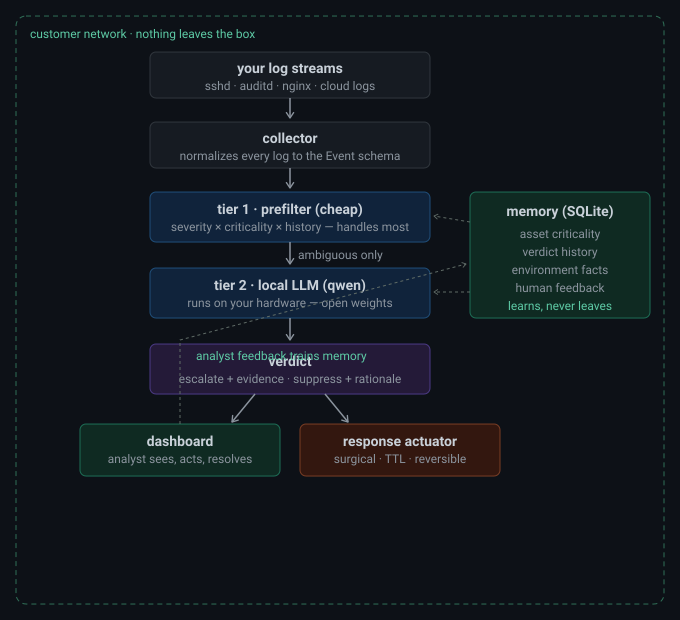
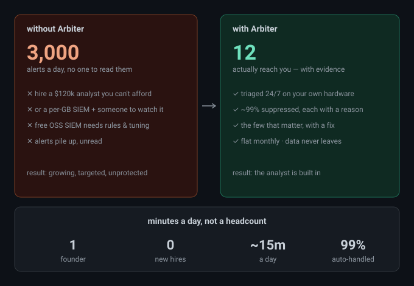
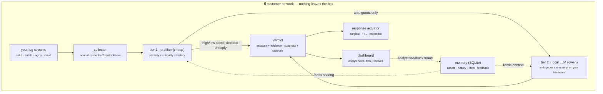
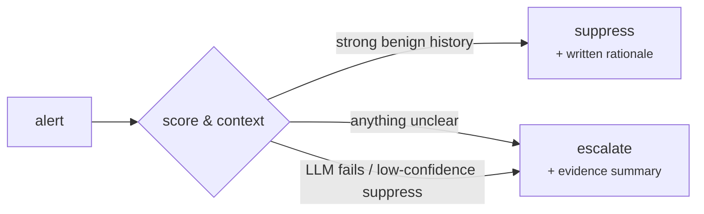

# Arbiter AI — architecture & positioning

> A self-hosted AI security analyst for companies too small to afford a SOC.
> Your data never leaves your network. For the full product vision see [`CONCEPT.md`](../CONCEPT.md).

## The problem it solves

Growing startups generate real log volume and are increasingly targeted, but they have no security hire. Their options today are all bad: hire an analyst they can't afford, buy a per-GB SIEM (Splunk-class) and *still* need someone to watch it, or run a free OSS SIEM that is "free like a puppy" — it needs someone to write rules and tune noise. So most run unprotected.

Arbiter's position isn't "cheaper Splunk." It's **the SIEM that doesn't need an analyst, because the analyst is built in.** The collection layer is table stakes; the AI triage brain is the product.

## How it works

Every alert flows through a two-tier brain and comes out as an auditable verdict. Nothing in this path calls the cloud.

The cost-control idea: a cheap rule-based **prefilter** handles the large majority of events (an LLM call per alert is far too expensive at log volume), and the **local LLM** only sees the ambiguous minority. The model runs on the customer's own hardware via Ollama (open weights), which is what makes "nothing leaves the network" true rather than marketing.

## The trust model (the make-or-break)

The fatal failure is suppressing a real breach — one miss and the customer turns Arbiter off forever. So error costs are deliberately **asymmetric**, enforced in several places:

- Suppression always needs stronger justification than escalation.
- Every suppression carries a written rationale; every escalation carries an evidence summary. No silent verdicts.
- A low-confidence "suppress" from the model is upgraded to escalate; if the model is unreachable, the event escalates by policy.
- **Shadow mode first**: Arbiter scores alongside the human for weeks before it earns the right to suppress anything.

## Adaptation through context, not weights

Arbiter gets smarter about *your* environment through a local, human-readable SQLite **memory layer** — asset criticality, per-signature verdict history, environment facts ("backups run at 02:00, ignore the IO spike"), and a human feedback loop — not through per-customer fine-tuning. This is more transparent than fine-tuned weights: the customer can read exactly why the system believes what it believes.

## Response — detect, triage, and act surgically

Escalations can carry a recommended response action (block an IP, kill a session, lock an account, quarantine a host). Actions are **surgical, TTL-limited, and reversible** — never service-wide. Auto-execution is reserved for the deterministic prefilter tier; the LLM tier only ever *recommends*, and a human approves. Blocking requires stronger justification than alerting, mirroring the trust model.

## Self-hosted dashboard

A stdlib-only web dashboard (see [`ADR-001`](ADR-001-dashboard-retention-iam.md)) fronts all of this: a zero-recon public splash, then two signed-in roles — **analyst** (see and act) and **admin** (also configure). The analyst confirms or overrules verdicts (which trains the memory layer), approves response actions, and resolves incidents with a note that Arbiter turns into a report. Raw audit detail is kept 30 days; the learned scoring history is never pruned.

## What ships vs. what's deferred

**In the current slice:** the Event/Verdict contract, the memory layer, both triage tiers (mock + local qwen), shadow mode, the JSONL/SQLite audit trail, the response actuator (dry-run), built-in IAM, and the dashboard.

**Deferred:** the shared threat-pattern feed (the network-effect moat — needs more than one customer, and ships anonymized *lessons*, never data), LoRA adaptation, and the collector-stack decision (Vector vs. Wazuh).

## Component map

| Concern | Module |
|---|---|
| Event/Verdict contract (the collector boundary) | `arbiter/schema.py` |
| Per-company memory: assets, history, facts | `arbiter/memory.py` |
| Tier 1 — cheap prefilter | `arbiter/prefilter.py` |
| Tier 2 — local LLM (Ollama / mock) | `arbiter/llm.py` |
| Orchestrator, shadow mode, audit trail | `arbiter/triage.py` |
| Response actuator (surgical, dry-run) | `arbiter/respond.py` |
| Queryable audit store + 30-day retention | `arbiter/store.py` |
| Built-in IAM (scrypt, signed cookies, roles) | `arbiter/iam.py` |
| Self-hosted dashboard (stdlib http.server) | `arbiter/web/` |
